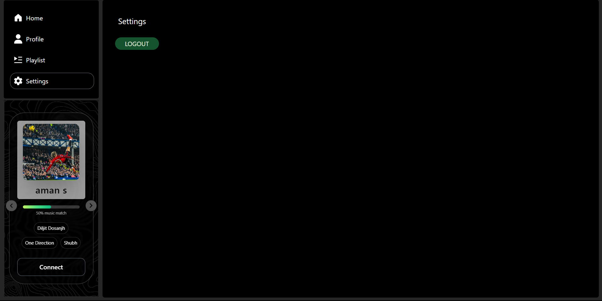
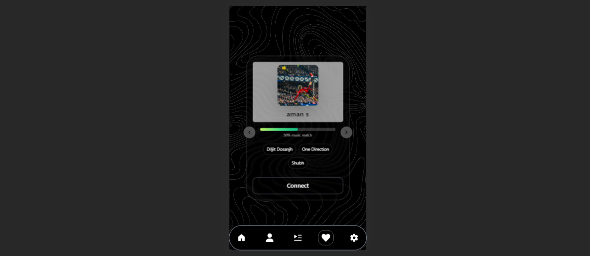

#  LyricLink – Connect Friends Through Music Taste

 is a web application that connects music lovers by analyzing their Spotify listening habits. Users can discover friends with similar tastes.

#  Features
Spotify Integration: Authenticate with Spotify to fetch your top   tracks, artists, and playlists.
Friend Matching: Find friends with similar music taste based on listening patterns.
Responsive Design: Fully responsive UI for both desktop and mobile users.
Real-time Updates: Firebase backend allows instant updates and friend connections.

# Screenshots

# Tech Stack
Frontend: Next.js, React, TypeScript, Tailwind CSS
Backend: Firebase (Authentication & Firestore for user data)
APIs: Spotify Web API for music data and user playlists
